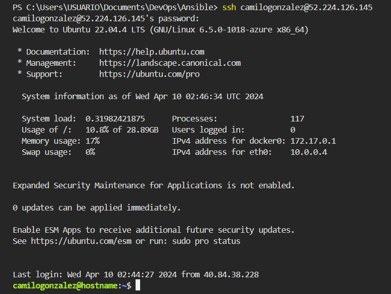
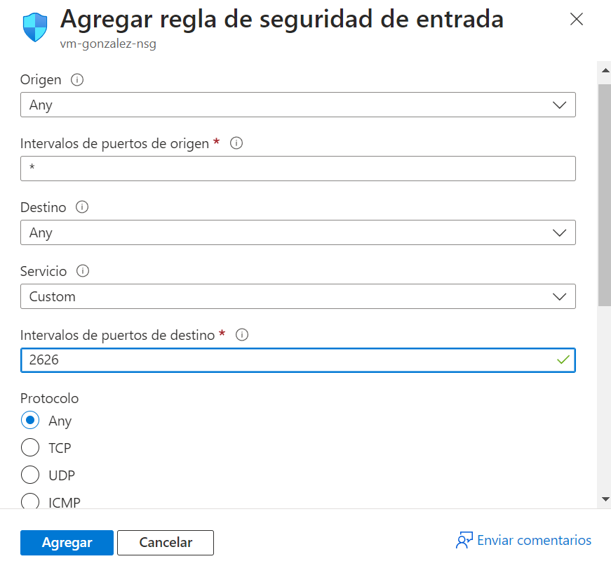
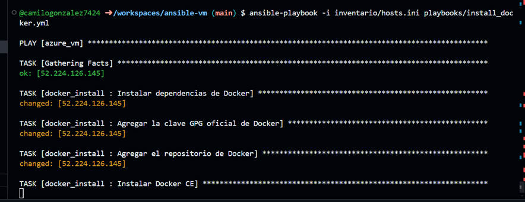
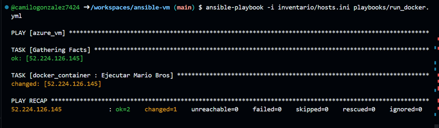
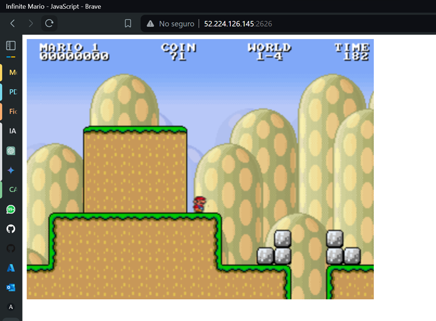
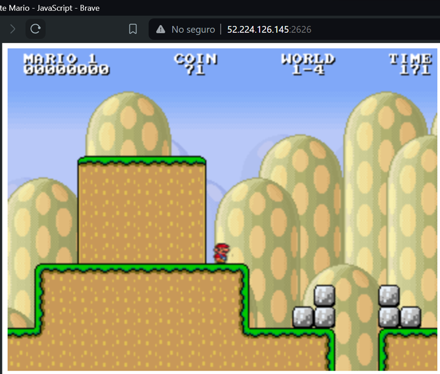

# <b> _**Ansible-vm**_ </b>

    El repositorio actual contiene todos los archivos necesarios para gestionar e implementar el 
    famoso video juego Mario bros utilizando para Ansible (gestión de configuración), 
    dentro de una maquina virtual que fue aprovisionada como IaC usando Terraform y Azure 
    como proveedor de nube.

**Nota:** Se recomienda usar Github CodeSpace para este proyecto para evitar errores que se pueden desencadenar por problemas de configuración en la máquina local.

## <b> _Prerrequisitos_ </b>

<p>
La Infraestructura como Código (IaC) debe estar operativa y ser accesible mediante SSH utilizando una dirección IP pública. En este caso, la autenticación se realizará mediante un nombre de usuario y una contraseña.</p>

<p>Es decir se debe tener una maquina virtual en azure funcional</p>

+ [Guia VM](https://github.com/camilogonzalez7424/azvm-modular-tf) 

La maquina virtual funcionando con ssh:




## <b> _Paso a paso_ </b> 📄

Para correr esta aplicación, debes seguir los siguientes pasos:

Inicialmente se asignan permisos a la carpeta del workspace haciendo uso del comando ```chmod 755 /carpeta/sub_carpeta```. Tambien es necesario asegurarse que el archivo de configuración de Ansible incluye la línea host_key_checking = False

Se debe crear una regla de seguridad de entrada en la máquina virtual para permitir que la conexión a la página del juego



Se hace uso del comando ```ansible-playbook -i inventory/hosts.ini playbooks/install_docker.yml``` instalamos las dependencias y demás herramientas necesarias para nuestra solicitud



El comando ```ansible-playbook -i inventory/hosts.ini playbooks/run_container.yml``` se encarga de levantar el contenedor y dejar el servicio activo y funcional.



Todo deberia funcionar sin problema y se puede probar:
Este caso, se debe colocar la ip publica de nuestra vm y el puerto elegido para correr la app fue el 2626:





## <b> _Por_ </b>

+ [Camilo González Velasco](https://github.com/camilogonzalez7424 "Camilo G.")


<br>

[](https://forthebadge.com)

